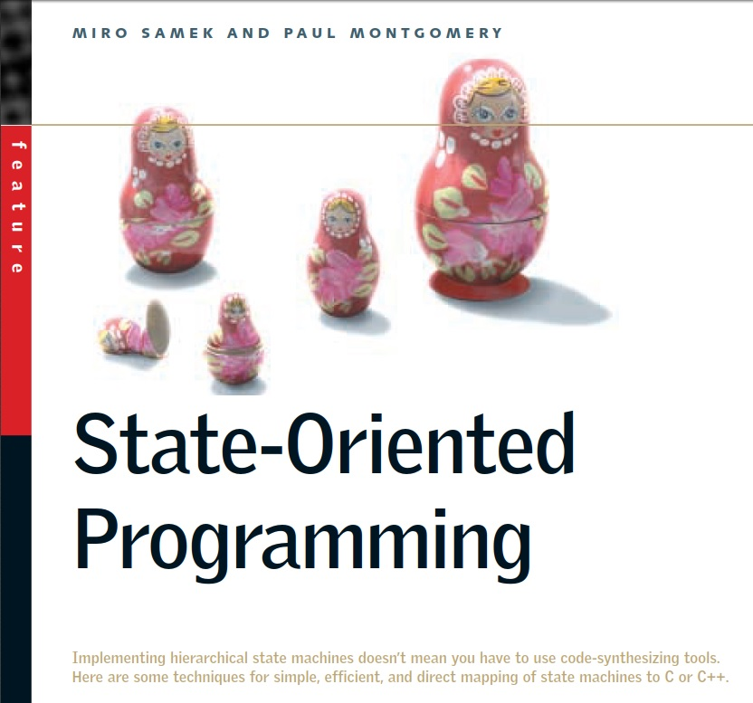
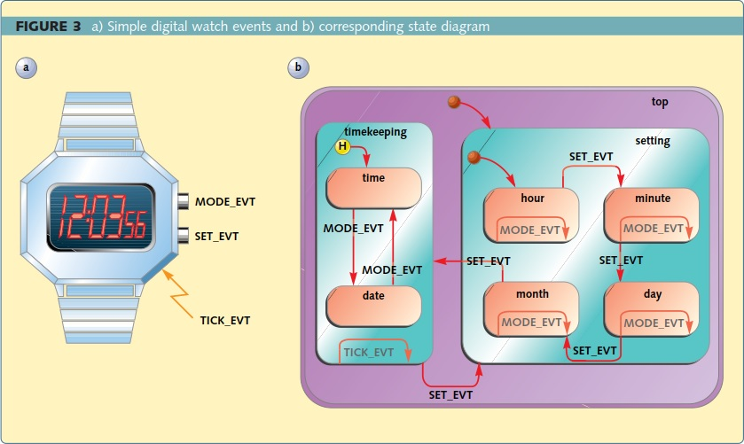
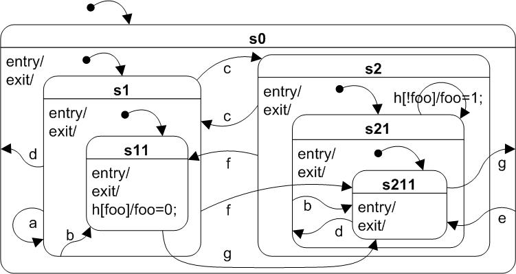

Marko Hammersen:
The only reason for this fork is to include the CPP files of this repository as "lib_deps" in a PlatformIO project. For some reason, unkonwn to me, PlatformIO only includes the C files of the original repo.
---------------------------------------------------------

## Brought to you by:
[](https://www.state-machine.com)

---------------------------------------------------------------------
[](State-Oriented_Programming.pdf)

# State Oriented Programming
# Hierarchical State Machines in C/C++

## Miro Samek and Paul Y. Montgomery
## May 13, 2000

["State-Oriented Programming"](State-Oriented_Programming.pdf) was
a cover story article published originally in
[Embedded Systems Programming](https://www.embedded.com/state-oriented-programming)
magazine in August 2000. This repository contains the article PDF and the updated code.

The code accompanying the "State-Oriented Programming" ESP article is licensed
under the open source MIT license (see the top-level comments in the hsm.h/c files).

The code is organized  into  two subdirectories:  C  and  Cpp. Each
subdirectory  contains the  make.bat batch file to  build the  code
with the GCC compiler.  This should work both on Windows (requires
MinGW or similar on GCC for Windows) and Linux/MacOS. The examples
include the digital watch discussed in the article  as well as the
"qhsmtst" test for the hierarchical state machine implementation (see
below).

Alternatively to using the make.bat file, you can simply type the
following command at the command prompt:

In the C directory:

`gcc watch.c hsm.c -o watch`

In the Cpp directory:

`g++ watch.cpp hsm.cpp -o watch`


For your convenience we have included the Windows executable file
(`watch.exe`), which  you  can try  directly.  You inject events
into  the watch  state   machine by typing numbers on your keyboard:
(0=MODE_EVT, 1=SET_EVT, 2=TICK_EVT, 3+ to exit).



Here is an example run for the C version of the watch code:

```
C:\tmp\State-Oriented_Programming\c>gcc watch.c hsm.c -o watch

C:\tmp\State-Oriented_Programming\c>watch
Enter:
0 for MODE_EVT
1 for SET_EVT
2 for TICK_EVT
3+ to exit

Watch::setting-START->hour;
Event<-0
time:  1:00:00
Event<-0
time:  2:00:00
Event<-1
Watch::hour-SET;
Event<-0
time:  2:01:00
Event<-0
time:  2:02:00
Event<-1
Watch::minute-SET;
Event<-0
date: 01-02
Event<-0
date: 01-03
Event<-1
Watch::day-SET;
Event<-0
date: 02-03
Event<-0
date: 03-03
Event<-1
Watch::month-SET;time:  2:02:00
Event<-2
Watch::time-TICK;time:  2:02:01
Event<-2
Watch::time-TICK;time:  2:02:02
Event<-0
Watch::time-MODE;date: 03-03
Event<-2
Watch::date-TICK;date: 03-03
Event<-2
Watch::date-TICK;date: 03-03
Event<-1
Watch::timekeeping-SET;Watch::setting-START->hour;
Event<-1
Watch::hour-SET;
Event<-1
Watch::minute-SET;
Event<-1
Watch::day-SET;
Event<-1
Watch::month-SET;date: 03-03
Event<-0
Watch::date-MODE;time:  2:02:04
Event<-4

C:\tmp\State-Oriented_Programming\c>
```

## Embedded Projects

In  order to use the code in your embedded projects you would need to
extract files `hsm.h` and `hsm.c` from the C subdirectory, or files
`hsm.hpp` and `hsm.cpp` form the Cpp subdirectory. We have compiled the
code with a variety  of  C  and  C++ compilers, including:  VC++  and
Borland compilers for Windows, GCC compiler for Linux, ARM   Software
Development Toolkit v. 2.0 and 2.5 C compiler, and Green Hills  MULTI
2000  C  and EC++ ARM/THUMB compilers.


## Notes About C++ Implementation

We have noticed one  potential problem with one aspect of the C++
implementation. Depending  on  the compiler  you  would  use  you may
encounter  compilation  errors in casting  (upcasting) event handlers
to a Hsm member function  pointer (EvtHndlr).  This  upcasting  is
necessary  to  configure  the  state machine  in  the  constructor.
In our code we use the  most  commonly accepted by different compilers
cast:

`(EvtHndlr)&<class>::<func>`

newer C++ compilers (but not EC++ compilers) may accept construct:

`reinterpret_cast<EvtHndlr>(&<class>::<func>)`

Your compiler may allow you to use a simpler form:

`(EvtHndlr)<func>`

since  specifying  class with the scope operator  ::  should  not  be
necessary inside the class method (the constructor).


## The QHsmTst Example

Since the publication of the original article, we've added a more
exhaustive example of a state machine called QHsmTst. The state machine
is completely artificial, but it contains all possible combinations of
transitions up to 3 levels of state nesting.

> **NOTE:** This example is borrowed from the book
["Practical Statecharts in C/C++" by Miro Samek](https://www.state-machine.com/psicc),
published in 2002.



 
The C version of the example is located in the C directory. You build it
exactly like the watch example:

`gcc hsmtst.c hsm.c -o hsmtst`

The C++ version of the example is located in the C directory. You build it
exactly like the watch example:

`g++ hsmtst.cpp hsm.cpp -o hsmtst`

Here is an example run for the C++ version of the HsmTst code:

```
C:\tmp\State-Oriented_Programming\cpp>g++ hsmtst.cpp hsm.cpp -o hsmtst

C:\tmp\State-Oriented_Programming\cpp>hsmtst
Events:
a-h for triggering events
x to exit

top-ENTRY;top-INIT;s1-ENTRY;s1-INIT;s11-ENTRY;
Event<-a
s1-A;s11-EXIT;s1-EXIT;s1-ENTRY;s1-INIT;s11-ENTRY;
Event<-e
top-E;s11-EXIT;s1-EXIT;s2-ENTRY;s21-ENTRY;s211-ENTRY;
Event<-e
top-E;s211-EXIT;s21-EXIT;s2-EXIT;s2-ENTRY;s21-ENTRY;s211-ENTRY;
Event<-a

Event<-h
s21-H;s211-EXIT;s21-EXIT;s21-ENTRY;s21-INIT;s211-ENTRY;
Event<-h

Event<-x

C:\tmp\State-Oriented_Programming\cpp>
```


## Updates
Since the publication of the "State-Oriented Programming" article, the
presented concepts and implementations have been completely revised,
improved and expanded in many direcctions. Among others, the **Real-Time
Framework** suggested in the article has been created and the vastly
improved hierarchical state machine implementation is now part of that
framework. Please see the QP Real-Time Embedded Frameworks (RTEFs) at:

https://www.state-machine.com/

